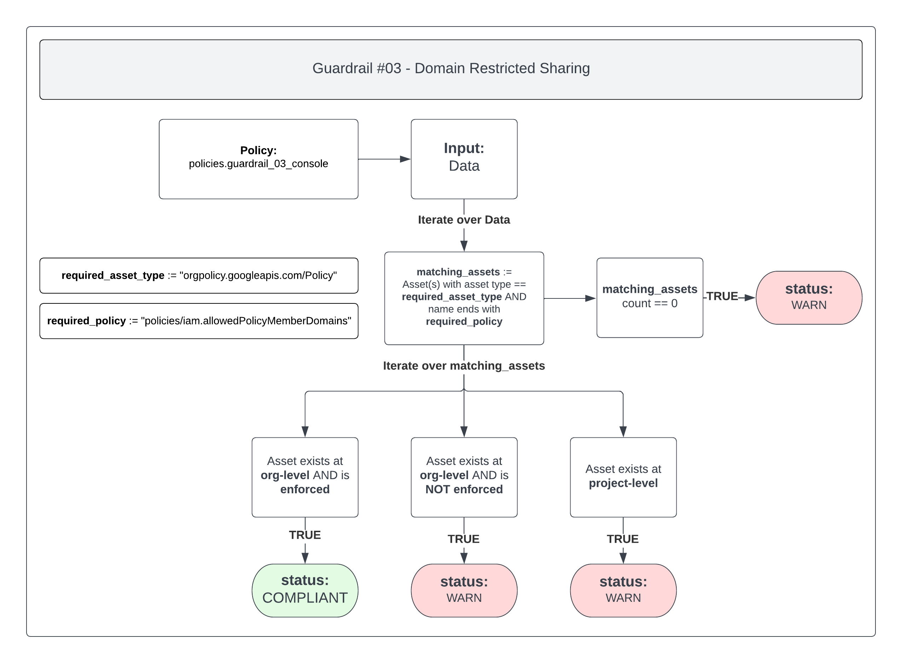
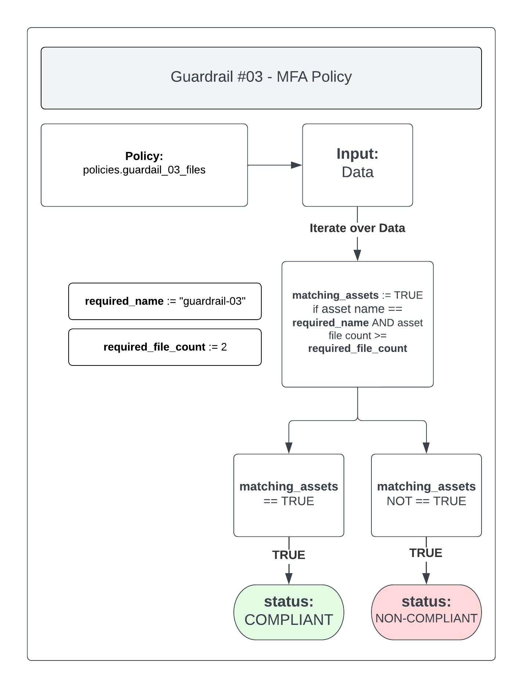

# Guardrail #03 - Cloud Console Access

Limit access to GC managed devices and authorized users.

**Key Considerations:**

- [ ] Implement multi-factor authentication mechanism for privileged accounts and remote network (cloud) access.
- [ ] Determine access restrictions and configuration requirements for GC managed devices, including those of non-privileged and privileged users, and configure access restrictions for endpoint devices accordingly.
Note: Some service providers may offer configuration options to restrict endpoint device access. Alternatively, organizational policy and procedural instruments can be implemented to restrict access.
- [ ] Ensure that administrative actions are performed by authorized users following a process approved by Chief Security Officer (CSO) (or delegate) and designated official for cyber security. This process should incorporate the use of trusted devices and a risk-based conditional access control policy with appropriate logging and monitoring enabled.
- [ ] Implement a mechanism for enforcing access authorizations.
- [ ] Implement password protection mechanisms to protect against password brute force attacks.

## Policies

- [03-console-access.rego](./03-console-access.rego)
- [03-file-check.rego](./03-file-check.rego)
- [03-access-policy.rego](./03-access-policy.rego)

## 03-console-access.rego

Google Cloud provides an organization policy whereby a domain restriction constraint can be added to limit resource sharing based on domain. This constraint allows you to restrict the set of identities that are allowed to be used in Identity and Access Management policies.

The Organization Policy is called `Domain restricted sharing` (ID: `constraints/iam.allowedPolicyMemberDomains`).

### Policy Flow Diagram



### Compliant

To mark this policy as `COMPLIANT`, the Organization Policy `Domain restricted sharing` (ID: `constraints/iam.allowedPolicyMemberDomains`) should be set at the Organization level and have a rule configured with Policy values set to `Custom` and Policy type set to `Allow`

The value(s) provided should be the Google Workspace customer ID. To retrieve that value you can run the following command:

```bash
gcloud organizations list
```

You should see a similar output like below:

```bash
DISPLAY_NAME           ID   DIRECTORY_CUSTOMER_ID
mydomain.com  12345678910               ABCdef123
```

In the return of the command, the Google Workspace customer ID is the `DIRECTORY_CUSTOMER_ID`.

>NOTE: The actual value used is not checked, only that a custom value is being used.

### Warn

If the policy is marked as `WARN` then the Organization Policy `Domain restricted sharing` (ID: `constraints/iam.allowedPolicyMemberDomains`):

- Has not been configured at all
- Has been configured with a Policy value other than `Custom` and/or a Policy type other than `Allow`
- Has been set at a Project level

Organization policies should be set solely at the Organization level to ensure they're inherited throughout the entire Google Cloud organization.

## 03-file-check.rego

Check for the presence of one (1) file in the `guardrail-03` Google Cloud Storage Bucket:

- MFA Policy Enforcement

### Policy Flow Diagram



### Compliant

To ensure the policy is `COMPLIANT` you should ensure that the one (1) file required is present in the `guardrail-03` Google Cloud Storage Bucket:

- MFA Policy Enforcement

>NOTE: Due to not being able to guarantee what name the file(s) will be, this policy will only check that the number of files present exceeds the minimum number required (including the default instructions.txt file).

### Non-Compliant

If this policy is found to be `NON-COMPLIANT` you should ensure that the one (1) file required is present in the `guardrail-03` Google Cloud Storage Bucket:

- MFA Policy Enforcement

You may also want to ensure that the default instructions.txt file is still present as well.

Finally, you may need to alter the `required_file_count` value inside `03-file-check.rego` to set what the minimum required number of files should be (including the default instructions.txt).

## 03-access-policy.rego

This policy checks for the existence of a `VPC Service Controls Perimeter` and an `Access Context Manager Access Level`.

More information about VPC Service Controls Perimeters can be found [here](https://cloud.google.com/vpc-service-controls/docs/service-perimeters).

More information about Access Context Manager Access Levels can be found [here](https://cloud.google.com/access-context-manager/docs/overview#access-levels).

It should be noted that due to the complex nature of VPC Service Controls and Access Context Manager, and the fact that no requirements currently exist, this policy only checks for the existence of either a Service Perimeter or an Access Level. It does not verify any of the contents or the validity of the actual setup.

### Policy Flow Diagram


### Compliant

To ensure the policy is `COMPLIANT` you should have a `VPC Service Controls Perimeter` and an `Access Context Manager Access Level` configured at the Organization level.

As mentioned in the `Overview` section, the actual configuration of either resource will not be verified - only the actual existence of either.

Instructions on setting up a VPC Service Controls Perimeter can be found [here](https://cloud.google.com/vpc-service-controls/docs/create-service-perimeters).

Instructions on setting up an Access Context Manager Access Level can be found [here](https://cloud.google.com/access-context-manager/docs/create-basic-access-level).

### Warn

If this policy is found to be `WARN` please ensure you have a `VPC Service Controls Perimeter` and an `Access Context Manager Access Level` configured at the Organization level.
