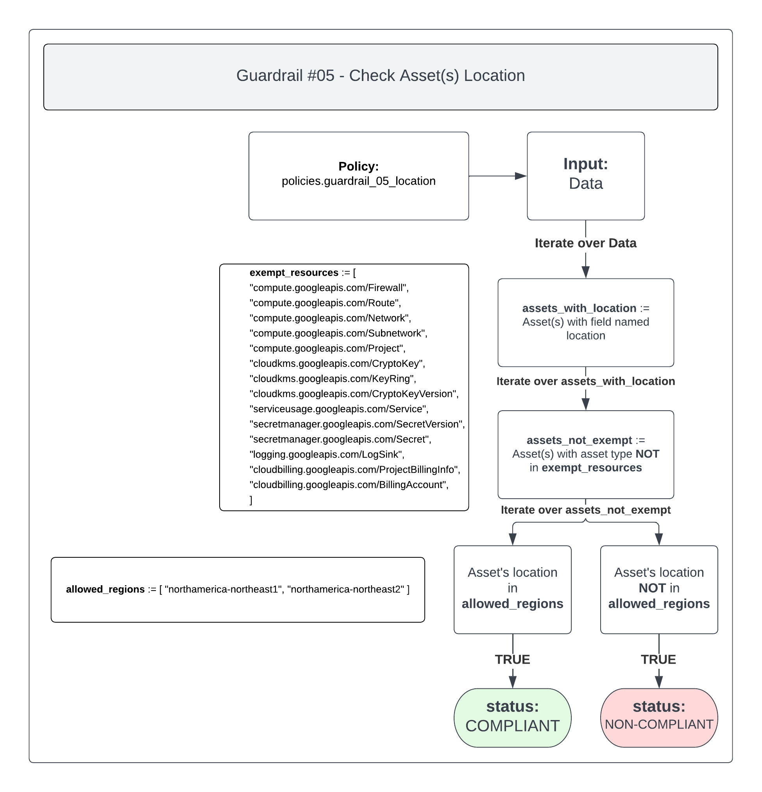

# Guardrail #05 - Data Location

Establish policies to restrict GC sensitive workloads to approved geographic locations

**Key Considerations:**

- [ ] As per the Directive on Service and Digital "Ensuring computing facilities located within the geographic boundaries of Canada or within the premises of a Government of Canada department located abroad, such as a diplomatic or consular mission, be identified and evaluated as a principal delivery option for all sensitive electronic information and data under government control that has been categorized as Protected B, Protected C or is Classified."

## Policies

- [05-data-location.rego](./05-data-location.rego)
- [05-restrict-location-org-policy.rego](./05-restrict-location-org-policy.rego)

## 05-data-location.rego

This policy will look through each resource and first check for the presence of a `location` field. If the field is not present then the resource isn't a location-based resource and can be safely ignored.

If the location field is present then the policy will check to see if the resource is `exempt`. Exempt resources exist only in a global location or can't exist in Canada. Currently, the list of exempt resources is being managed manually.

If the resource is not exempt, then its location will be checked against a list of approved locations. If no match is found, then the resource is considered `NON-COMPLIANT`. If there is a match, then the resource is considered `COMPLIANT`

### Policy Flow Diagram

### Compliant

To mark this policy as `COMPLIANT` then every resource must reside in one of the approved locations. These locations are:

- northamerica-northeast1
- northamerica-northeast2

### Non-Compliant

If the policy is marked as `NON-COMPLIANT` then it will reply with each asset that is located in an unapproved location, including the location they're currently in.

Moving them to any of the approved locations will clear their non-compliance.

## 05-restrict-location-org-policy.rego

Google Cloud provides an organization policy that allows you to define a set of locations where location-based GCP resources can be created.

This policy allows you to specify value groups, which are collections of locations that are curated by Google to provide a simple way to define your resource locations.

One of the value groups is `in:canada-locations` which, when set, ensures that any location-based GCP resource must exist in Canada.

More information regarding value groups can be found [here](https://cloud.google.com/resource-manager/docs/organization-policy/defining-locations#value_groups).

### Policy Flow Diagram

### Compliant

In order to mark this policy as `COMPLIANT`, the Organization Policy `Google Cloud Platform - Resource Location Restriction` (ID: `constraints/gcp.resourceLocations`) should have a rule configured with Policy values set to `Custom` and Policy type set to `Allow`

The value provided should be `in:canada-locations`.

### Warn

If the policy is marked as `WARN` then the following error(s) could be present:

- Has not been configured at the Organization level
- Has been configured at the Organization level with:
  - a Policy value other than `Custom`
  - a Policy type other than `Allow`
  - a value other than `in:canada-locations`, or contains other values alongside it
- Has been configured at the Project level with a value other than the ones above, while also being set at the Organization level with a rule configured with compliant settings

The last point would be considered an override whereby the project level organization policy is overriding the organization level policy for the project it's alerting on.

>NOTE: A WARN will also be triggered if the policy is set at the project level with compliant settings. Although the policy is configured with the appropriate rule, organization policies should be set solely at the Organization level to ensure they're inherited throughout the entire Google Cloud organization.
