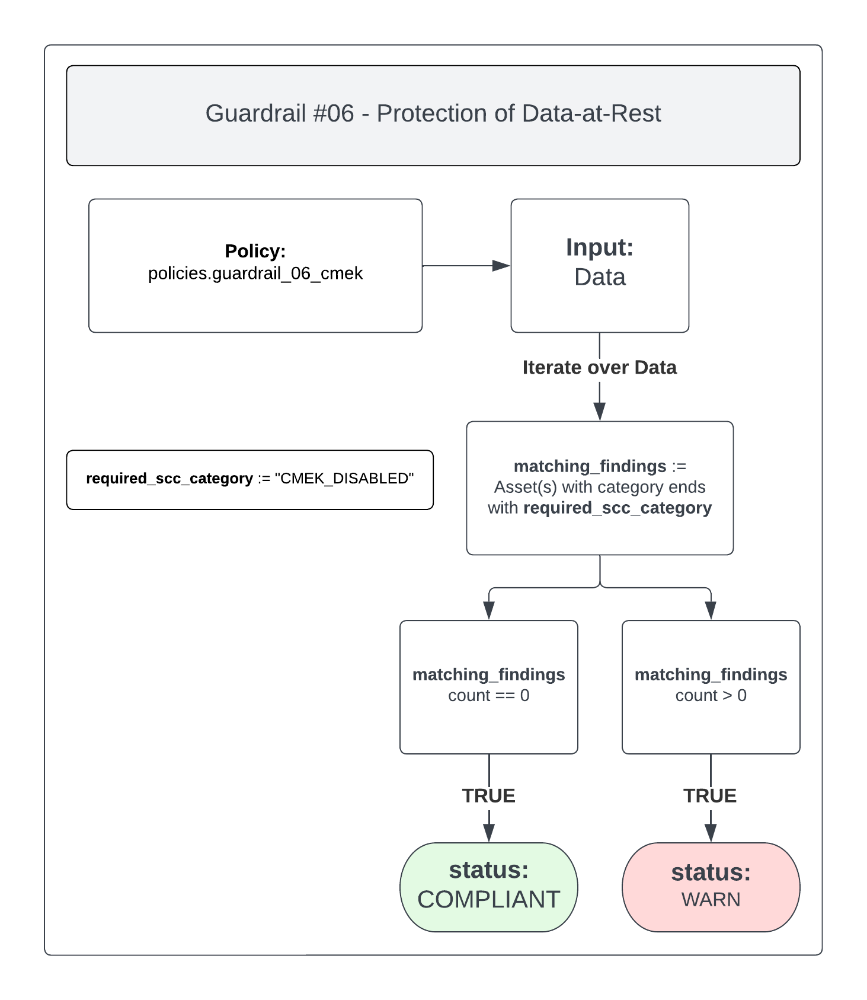

# Guardrail #06 -  Protection of Data-at-Rest

Protect data at rest by default (e.g. storage) for cloud-based workloads.

**Key Considerations:**

- [ ] Seek guidance from privacy and access to information officials within institutions before storing personal information in cloud-based environments.
- [ ] Implement an encryption mechanism to protect the confidentiality and integrity of data when data are at rest in your solution's storage.
- [ ] Use CSE-approved cryptographic algorithms and protocols, in accordance with 40.111 and 40.062.
- [ ] Implement key management procedures.

## Policies

- [06-data-at-rest.rego](./06-data-at-rest.rego)

## 06-data-at-rest.rego

All data stored within Google Cloud is encrypted at rest using the same hardened key management systems that Google uses for their own encrypted data. There is an option to create your own managed encryption keys in Cloud KMS, known as Customer-managed encryption keys (CMEK). This lets you have greater control over the keys used to encrypt data at rest within supported Google Cloud services.

Security Command Center (SCC) is Google Cloud's centralized vulnerability and threat reporting service, and can be leveraged to check for CMEK vulnerabilities.

This policy will check for any findings in Security Command Center that relate to CMEK being disabled, which implies that data is not being encrypted with customer-managed encryption keys.

### Policy Flow Diagram

### Compliant

To ensure the policy is `COMPLIANT` you must have CMEK integrated with all available services.

More information on how to enable and integrate CMEK can be found here: [link](https://cloud.google.com/kms/docs/use-keys-google-cloud#cmek_compliant).

### Non-Compliant

If this policy is found to be `WARN` please check Security Command Center for more information regarding the alert. Ensure that any alerts who's category is related to `CMEK_DISABLED` have been resolved.
