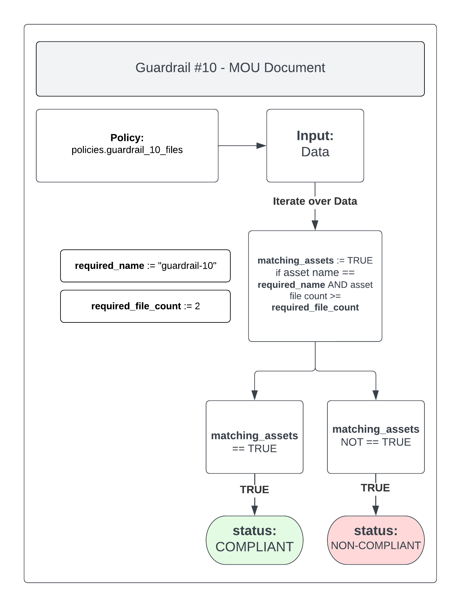

# Guardrail #10 - Cyber Defense Services

Establish MOU for defensive services and threat monitoring protection services.

**Key Considerations:**

- [ ] Sign an MOU with CCCS.
- [ ] Implement cyber defense services where available.

## Policies

- [10-file-check.rego](./10-file-check.rego)

## 10-file-check.rego

Check for the presence of one (1) file in the `guardrail-10` Google Cloud Storage Bucket:

- MOU Document

### Policy Flow Diagram

### Compliant

To ensure the policy is `COMPLIANT` you should ensure that the one (1) file required is present in the `guardrail-10` Google Cloud Storage Bucket:

- MOU Document

>NOTE: Due to not being able to guarantee what name the file(s) will be, this policy will only check that the number of files present exceeds the minimum number required (including the default instructions.txt file).

### Non-Compliant

If this policy is found to be `NON-COMPLIANT` you should ensure that the one (1) file required is present in the `guardrail-10` Google Cloud Storage Bucket:

- MOU Document

You may also want to ensure that the default instructions.txt file is still present as well.

Finally, you may need to alter the `required_file_count` value inside `10-file-check.rego` to set what the minimum required number of files should be (including the default instructions.txt).
