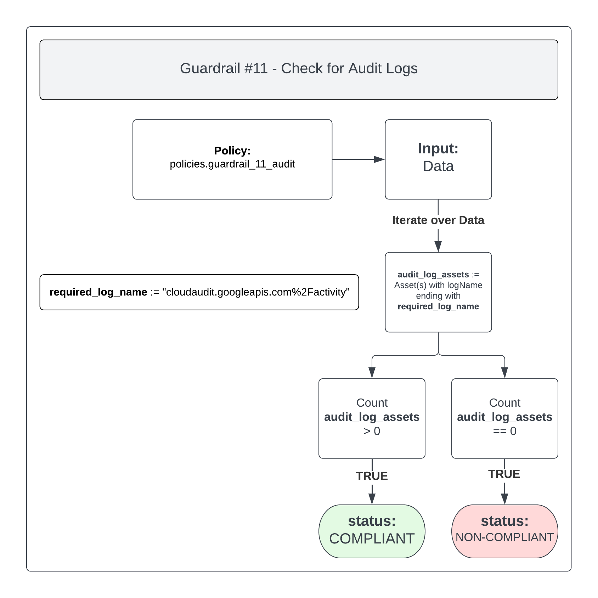
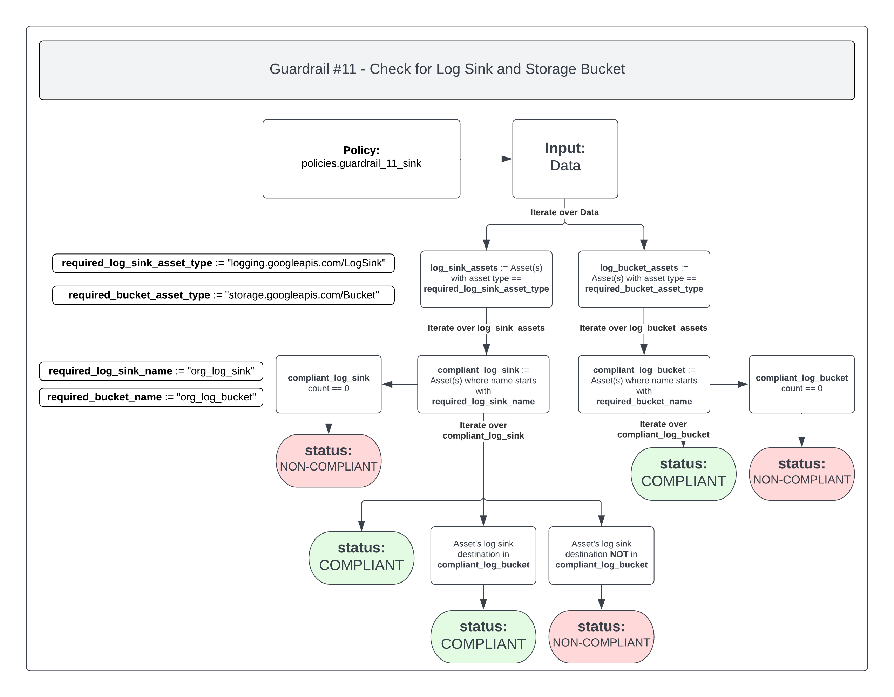

# Guardrail #11 -  Logging and Monitoring

Enable logging for the cloud environment and for cloud-based workloads.

**Key Considerations:**

- [ ] Implement adequate level of logging and reporting, including a security audit log function in all information systems.
- [ ] Identify the events within the solution that must be audited in accordance with GC Event Logging.
Note: You may need to configure your solution to send the audit log records to a centralized logging facility, if one is available, where existing auditing mechanisms will be applied.
- [ ] Configure alerts and notifications to be sent to the appropriate contact/team in the organization.
- [ ] Configure or use an authoritative time source for the time-stamp of the audit records generated by your solution components.
- [ ] Continuously monitor system events and performance.

## Policies

- [11-cloud-audit-logs.rego](./11-cloud-audit-logs.rego)
- [11-log-sink.rego](./11-log-sink.rego)

## 11-cloud-audit-logs.rego

Google Cloud services write audit logs that record administrative activities and access within your Google Cloud resources. Having audit logs enabled helps your security, auditing, and compliance entities monitor Google Cloud data and systems for possible vulnerabilities or external data misuse.

There are four (4) types of audit logs and they can be read here: [link](https://cloud.google.com/logging/docs/audit#types).

What's important to know is that all of the types of audit logs, minus Data Access audit logs, are enabled by default and can't be disabled. Data Access audit logs-- except for BigQuery Data Access audit logs-- are disabled by default because audit logs can be quite large, which can incur unnecessary costs.

Because audit logging is enabled by default, can't be disabled, and has a high retention period, this policy will only check for the presence of a single audit log type (admin activity) in the last 24 hours.

More information regarding Cloud Audit logs found here: [link](https://cloud.google.com/logging/docs/audit).

### Policy Flow Diagram

### Compliant

To ensure the policy is `COMPLIANT` you should have audit logs enabled - which is taken care of you by default.

### Non-Compliant

If this policy is found to be `NON-COMPLIANT` then you may need to change the date cutoff for the command responsible for exporting the audit logs. Currently, it is set to 24 hours, as there should be at least 1 (one) audit log found during that time. If for some reason this is not true, you can change the date cutoff to be greater than 24 hours.

## 11-log-sink.rego

Google Cloud allows you to configure log Sinks. Sinks control how Cloud Logging routes logs. Using sinks, you can route some or all of your logs to supported destinations.

One of the supported destinations is Cloud Logging log buckets.

Log sinks are used primarily for compliance purposes, whereby logs must be retained for a specific number of days.

This policy will check for the presence of a log sink that's configured with a sink destination of a Cloud Logging log bucket.

### Policy Flow Diagram

### Compliant

To ensure the policy is `COMPLIANT` you should have a log sink configured with a name that starts with `org_log_sink`.

You should also have a Cloud Logging log bucket configured with a name that starts with `org_log_bucket`.

The required log sink should be set up to use the required Cloud Logging log bucket as the sink destination.

### Non-Compliant

If this policy is found to be `NON-COMPLIANT` then one of the following may be true:

- A log sink has not been detected, or is not named properly
- A Cloud Logging log bucket has not been detected, or not named properly
- A log sink hasn't been configured with the proper Cloud Logging log bucket as its sink destination
