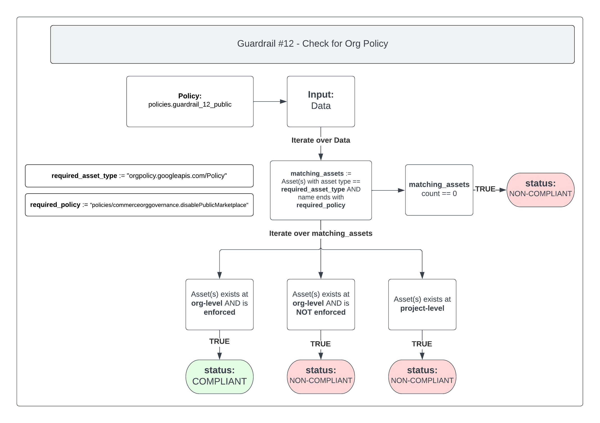
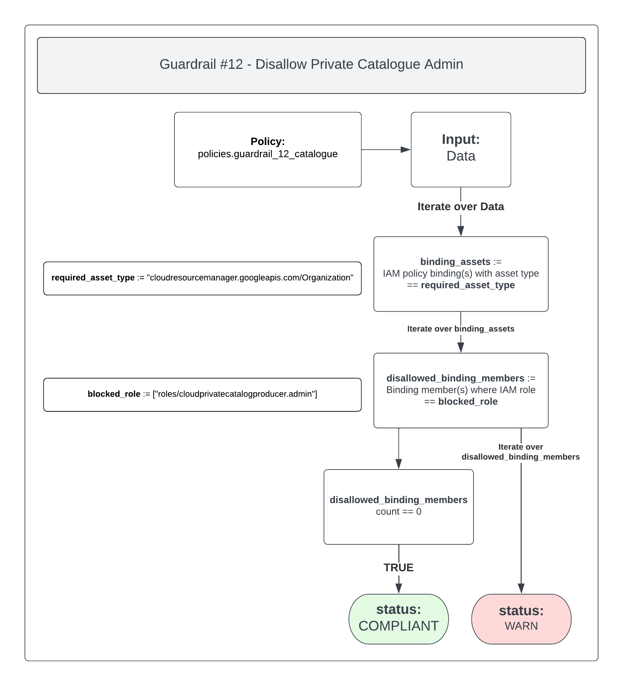

# Guardrail #12 - Configuration of Cloud Marketplaces

Restrict Third-Party CSP Marketplace software to GC-approved products.

**Key Considerations:**

- [ ] Only GC approved cloud marketplace products are to be consumed. Turning on the commercial marketplace is prohibited.
- [ ] Submit requests to add third-party products to marketplace to SSC Cloud Broker.
Validation
- [ ] Confirm that third-party marketplace restrictions have been implemented.

## Policies

- [12-disable-public-marketplace-org-policy.rego](./12-disable-public-marketplace-org-policy.rego)
- [12-private-catalogue-admin.rego](./12-private-catalogue-admin.rego)

## 12-disable-public-marketplace-org-policy.rego

Google Cloud provides an organization policy that allows you to disable public marketplace for all users under the organization. Public marketplace can contain unapproved content and therefore should be disabled in favor of using Private Catalog.

This policy will check to ensure the Organization Policy is configured and enforced.

The Organization Policy is called `Disable Public Marketplace` (ID: `constraints/commerceorggovernance.disablePublicMarketplace`).

### Policy Flow Diagram

### Compliant

In order to mark this policy as `COMPLIANT`, the Organization Policy `Disable Public Marketplace` (ID: `constraints/commerceorggovernance.disablePublicMarketplace`) should be set at the Organization level and have a rule configured with `Enforcement` set to `On`.

### Non-Compliant

If the policy is marked as `NON-COMPLIANT` then the Organization Policy `Skip default network creation` (ID: `constraints/compute.skipDefaultNetworkCreation`):

- Has not been configured at the Organization level
- Has been configured at the Organization level with a value other than `Enforcement` set to `on`
- Has been configured at the Project level with a value other than `Enforcement` set to `on`, while also being set at the Organization level with a rule configured with `Enforcement` set to `on`

The last point would be considered an override whereby the project level organization policy is overriding the organization level policy for the project it's alerting on.

### Warn

If the policy is marked as `WARN` then the Organization Policy `Skip default network creation` (ID: `constraints/compute.skipDefaultNetworkCreation`):

- Has been set at a Project level with a rule configured with `Enforcement` set to `on`

Although the policy is configured with the appropriate rule, organization policies should be set solely at the Organization level to ensure they're inherited throughout the entire Google Cloud organization.

>NOTE: A WARN can exist alongside a COMPLIANT to ensure that the project level policy is brought to attention and addressed as necessary.

## 12-private-catalogue-admin.rego

In Google Cloud there is a feature called Service Catalog, whereby administrators can make their approved solutions discoverable to their internal enterprise users. Administrators can manage their solutions and ensure their users are always launching the latest versions.

To ensure only Organization Administrators can manage solutions, this policy will scan for the Organization IAM policy binding for any members assigned the IAM role `cloudprivatecatalogproducer.admin`.

### Policy Flow Diagram

### Compliant

To ensure the policy is `COMPLIANT` you should not have the IAM role `cloudprivatecatalogproducer.admin` assigned to any members in the Organization IAM policy.

Instead, you should favor using the Organization Administrator IAM role to grant the appropriate access to Service Catalog.

### Non-Compliant

If this policy is found to be `NON-COMPLIANT` then you will be returned with a list of user(s) who have the `cloudprivatecatalogproducer.admin` role assigned to them in the Organization IAM policy.

Ensure you edit the IAM policy at the Organization level and remove the role from any members.
