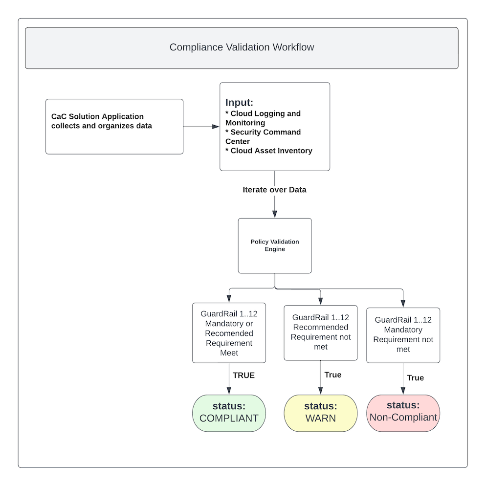

# Compliance as Code Toolkit

This repository contains all the policy artifacts for the CaC Tool. Each policy has a seperate readme document explaining the control, check process and flow used to evaluate the target GCP organization.

<!-- TOC start -->
- [Compliance as Code Toolkit](#compliance-as-code-toolkit)
  - [Overall workflow for CaC Validation Checking](#overall-workflow-for-cac-validation-checking)
  - [Guardrail 1](01-protect-accounts/README.md#guardrail-1): Protect root or master account used to establish the cloud service.
  - [Guardrail 2](02-mgmt-admin-privileges/README.md#guardrail-2): Establish access control policies and procedures for management of administrative privileges.
  - [Guardrail 3](03-cloud-console-access/README.md#guardrail-3): Limit access to GC managed devices and authorized users.
  - [Guardrail 4](04-monitoring-account/README.md#guardrail-4): Create role-based account to enable enterprise monitoring and visibility.
  - [Guardrail 5](05-data-location/README.md#guardrail-5): Establish policies to restrict GC sensitive workloads to approved geographic locations
  - [Guardrail 6](06-protect-data-at-rest/README.md#guardrail-6): Protect data at rest by default (e.g. storage) for cloud-based workloads.
  - [Guardrail 7](07-protect-data-in-transit/README.md#guardrail-7): Protect data transiting networks through the use of appropriate encryption and network safeguards.
  - [Guardrail 8](08-segment-and-separate/README.md#guardrail-8): Segment and separate information based on sensitivity of information.
  - [Guardrail 9](09-network-security-services/README.md#guardrail-9): Establish external and internal network perimeters and monitor network traffic.
  - [Guardrail 10](10-cyber-defense-services/README.md#guardrail-10): Establish MOU for defensive services and threat monitoring protection services.
  - [Guardrail 11](11-logging-and-monitoring/README.md#guardrail-11): Enable logging for the cloud environment and for cloud-based workloads.
  - [Guardrail 12](12-market-place/README.md#guardrail-12): Restrict Third-Party CSP Marketplace software to GC-approved products.
  - [Guardrail 13](13-plan-for-continuity/README.md#guardrail-13): Restrict Third-Party CSP Marketplace software to GC-approved products.

<!-- TOC end -->
## Overall workflow for CaC Validation Checking




## Environment Variables with OPA repository

If you want to pass a list as a variable (i.e. you want `myvar := ["item1", "item2", "item3"]`), you *CANNOT* do `export MYVAR = '["item1", "item2", "item3"]'` as this will be interpreted as a string (that just looks like a list).

Attempting to make the item a list using square brackets `[ ]` in Rego will introduce a lot of additional escape `\\` characters for the escapes and quotes -- and this is not what we want. Instead, what you want is to export your list variable values as unquoted, comma-delimited strings and we then use Rego's [`string.split`](https://www.openpolicyagent.org/docs/latest/policy-reference/#builtin-strings-split) function to split your string and returns a list object where and item will be in double quotes.

For example: `export MYVAR = "item1,item2,item3"`, once passed to `string.split(env["MYVAR"], ",")`, will become `["item1", "item2", "item3"]`


### List of ENV VARS

Naming format is `GR<GUARDRAIL_NUMBER>_<VALIDATION_NUMBER>_VARNAME`.  If the `VARNAME` is plural, then the env var is expected to be a list.

i.e. 
- `GR01_03_DOMAIN` is an env var for Guardrail 01, Validation 03 and it's the domain
- `GR02_08_ALLOWED_DOMAINS` is an env var for Guardrail 02, Validation 08 and is a list of allowed domain(s) -- and of course, if it's only 1 item in this list, that is okay too


```
required_domain := env["GR01_03_DOMAIN"]
required_privileged_users_list := split(env["GR01_06_PRIVILEGED_USERS"], ",")
required_regular_users_list := split(env["GR01_06_REGULAR_USERS"], ",")

required_domain := env["GR02_01_DOMAIN"]
required_privileged_users_list := split(env["GR02_01_PRIVILEGED_USERS"], ",")
required_regular_users_list := split(env["GR02_01_REGULAR_USERS"], ",")
required_domains_allow_list := split(env["GR02_08_ALLOWED_DOMAINS"], ",")
required_domains_deny_list := split(env["GR02_08_DENY_DOMAINS"], ",")
required_has_guest_users := env["GR02_09_HAS_GUEST_USERS"]
required_has_guest_users := env["GR02_10_HAS_GUEST_USERS"]

required_customer_ids := split(env["GR03_01_CUSTOMER_IDS"], ",")
required_allowed_cidrs := split(env["GR03_01_ALLOWED_CIDRS"], ",")

required_security_category_key := env["GR05_01_SECURITY_CATEGORY_KEY"]

required_allowed_ca_issuers_list := split(env["GR07_03_ALLOWED_CA_ISSUERS"], ",")

required_org_id := env["GR11_04_ORG_ID"]
```
